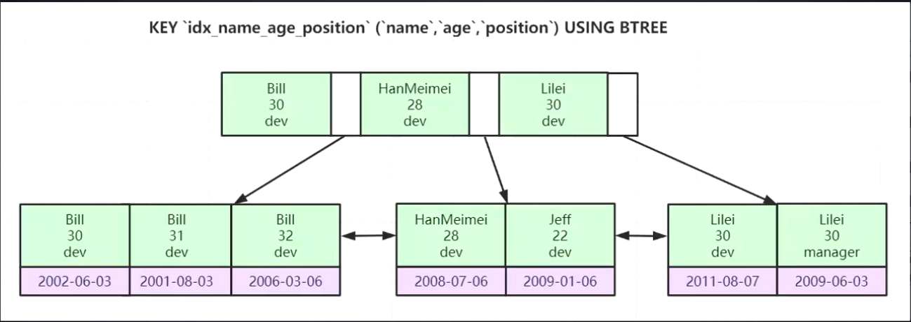

#### 1. 索引数据结构红黑树，Hash，B+树详解

​	**索引是帮助MySQL搞笑获取数据的排好序的数据结构**

​	索引数据结构：

	1. 二叉树
	2. 红黑树
	3. Hash表
	4. B-Tree
	  	1. 叶节点具有相同的深度，叶节点的指针为空
	  	2. 所有索引元素不重复
	  	3. 节点中的数据索引从左到右递增排序
	5. B+Tree（B-Tree变种）
	  	1. 非叶子节点不存储data，只存储索引（冗余），可以放更多的索引
	  	2. 叶子节点包含所有索引字段
	  	3. 叶子节点用指针连接，提高区间访问的性能

#### 2. 千万级数据表如何用B+树索引快速查找

索引，数据不分离

二分查找

#### 3. 聚集索引&聚簇索引&稀疏索引到底是什么

**MyISAM索引是非聚簇索引：索引文件(.myi)和数据文件(.myd)是分离的**

稀疏索引也是非聚簇索引

**InnoDB索引是聚簇索引：**

 	1. 表数据文件本身就是按照B+Tree组织的一个索引结构文件
 	2. 聚集索引-叶节点包含了完整的数据记录
 	3. 为什么建议InnoDB表必须建主键，并且推荐使用整型的自增主键？
 	4. 为什么非主键索引结构叶子节点存储的是主键值？（一致性和节省存储空间）

#### 4. 为什么DBA总推荐使用自增主键做索引

1.  整型自增主键比较比字符串效率高，占用资源少
2.  整型占用空间少，节约资源

#### 5. 联合索引底层数据结构又是怎样的

多个字段共同组织成一个索引

联合主键，最左前缀排序

#### 6. Mysql最左前缀优化原则是怎么回事

按照索引建的顺序比较决定先后顺序

**排好序**

不符合最左前缀索引，无法按顺序搜索

#### 7. 分库分表

**阿里的开发规范中建议预估三年内单表数据量上500w，或者大小上2G，就要考虑分库分表。**

##### 	分库分表的问题

1.  定制主键生成策略

    主键是分库分表中非常重要的业务要素，通常分库分表都会采用主键来作为分片键，这个时候主键就不再只是用来提升查询效率了，还需要坚固数据分片的效率。

    要如何定制高效的主键生成策略？

    分布式主键要怎么设计？

    1.  全局唯一
    2.  高性能
    3.  高可用
    4.  趋势递增

    数据库自增长：单机下自增长没有问题，但是分布式情况下会造成主键冲突。

    

2.  很多SQL不支持

    例如MySQL里会配for each标签来执行批量SQL，原始数据是支持的，但是分库分表不支持。

    查询SQL比较多时，路由策略是否支持？

3.  其他问题

    数据迁移，扩缩容，公共表，读写分离，配置往注册中心集中配置

4.  分布式事务处理

