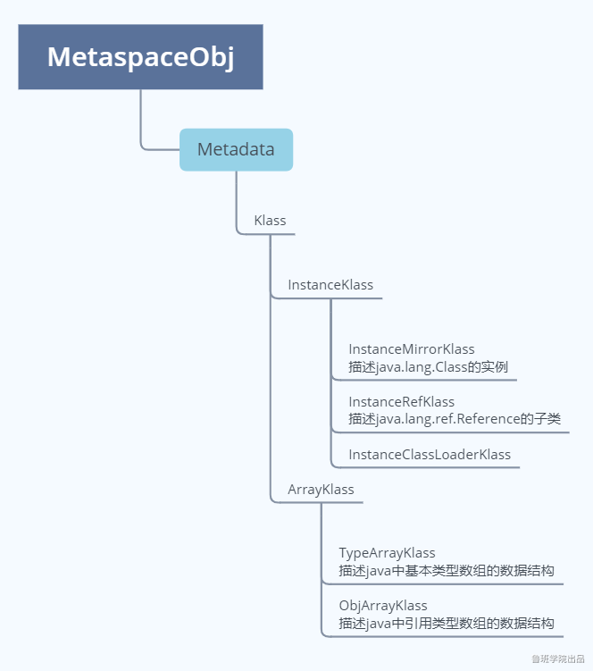
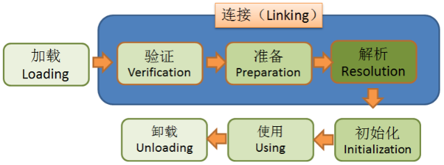
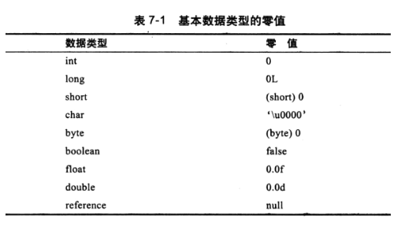
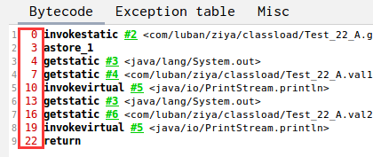
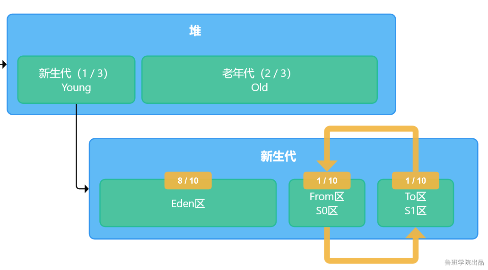

## JVM
**类加载器子系统：类加载，类加载器**

****

### 类加载

**klass模型**

    Java的每个类，在JVM中，都有一个对应的klass类实例与之对应，存储类的元信息如：常量池，属性信息，方法信息......

看下klass模型类的继承结构：



**从继承关系上来看，类的元信息是存储在元空间的**

    普通的Java类在JVM中对应的是instanceKlass类的实例，再来说下它的三个子类：
    1. InstanceMirrorKlass：用于表示java.lang.Class，Java代码中获取到的Class对象，实际上就是这个C++类的实例，存储在堆区，学名镜像类
    2. InstanceRefklass：用于表示java/lang/ref/Reference类的子类
    3. InstanceClassLoaderKlass：用于遍历某个加载器加载的类
    
    Java中的数组不是静态数据类型，是动态数据类型，即是运行期生成的，Java数组的元信息用ArrayKlass的子类来表示：
    1. TypeArrayKlass：用于表示基本类型的数组
    2. ObjArrayKlass：用于表示引用类型的数组

****

#### 类加载的过程
**类加载由7个步骤完成，看图**
		类的生成周期是由7个阶段组成，但是类的加载说的是前5个阶段



##### 1. 加载

1.  通过类的全县定名获取存储该类的class文件(没有指明必须从哪获取)
2.  解析成运行时数据，即instanceKlass实例，存放在方法区
3.  在堆区生成该类的Class对象，即instanceMirrorKlass实例

**何时加载：**

​		**主动使用时**

1.  new，getstatic，putstatic，invokestatic
2.  反射
3.  初始化一个类的子类会去加载其父类
4.  启动类(main函数所在类)
5.  当使用jdk1.7动态语言支持时，如果一个java.lang.invoke.MethodHandle实例最后的解析结果REF_getstatic，REF_putstatic，REF_invokestatic的方法句柄，并且这个方法句柄所对应的类没有进行初始化，则需要先去触发其初始化

**预加载：包装类，String，Thread**

因为没有指明从哪获取class文件，脑洞大开的工程师们开发了这些

1.  从压缩包中读取，如jar，war
2.  从网络中获取，如Web Applet
3.  动态生成，如动态代理，CGLIB
4.  由其他文件生成，如JSP
5.  从数据库读取
6.  从加密文件中读取

##### 2. 验证

1.  文件格式验证
2.  元数据验证
3.  字节码验证
4.  符号引用验证

##### 3. 准备

为静态变量分配内存，赋<font color="#dd0000">初值</font>

实例变量是在创建对象的时候完成赋值的，没有赋初值一说


**如果被final修饰，在编译的时候会给属性添加ConstantValue属性，准备阶段直接完成赋值，即没有赋初值这一步**

##### 解析

**将常量池中的符号引用转为直接引用**

解析后的信息存储在ConstantPoolCache类实例中

1.  类或接口的解析
2.  字段解析
3.  方法解析
4.  接口方法解析

**何时解析**

思路：

	1. 加载阶段解析常量池时
	2. 用的时候

openjdk是第二种思路，在执行特定的字节码指令之前进行解析：

	anewarray、checkcast、getfield、getstatic、instanceof、invokedynamic、invokeinterface、invokespecial、invokestatic、invokevirtual、ldc、ldc_w、ldc2_w、multianewarray、new、putfield

##### 初始化

**执行静态代码块，完成静态变量的赋值**

静态字段，静态代码段，字节码层面会生成clinit方法

方法中语句的先后顺序与代码的编写顺序相关

```java
public class Test_1 {
    public static void main(String[] args) {
        System.out.printf(Test_1_B.str);
    }
}

class Test_1_A {
    public static String str = "A str";

    static {
        System.out.println("A Static Block");
    }
}

class Test_1_B extends Test_1_A {
    static {
        System.out.println("B Static Block");
    }
}
```

****

#### 内存池与JVM内存模型
    JVM内存模型就是JVM在启动的时候从操作系统内存中分配出来的一块打内存
    然后将这个大内存分成五个区域：方法区，堆区，虚拟机栈，本地方法栈，程序计数器

**注意区分JVM内存模型与JMM(Java Memory Model)**
    

#### 四个名词
**class文件**

    即硬盘上的.class文件

**class content**

    类加载器将硬盘上的.class 文件读入内存中的那一块内存区域

**Class对象**

    Class<?> clazz = Test_22.class

**对象**

    Test_22 obj = new Test_22();

#### JVM内存模型
**方法区**

    需要搞清楚方法区，永久代，元空间三个名词之间的关系
    方法区是规范，永久代，元空间是具体实现。或者说，方法区是Java中的接口，永久代，元空间是Java中接口的实现类
    
    再说下永久代，元空间的区别
    永久代：jdk8之前方区的实现，在堆中，用于存放类的元信息，及InstanceKlass类的实例
    元空间：jdk8及之后方法区的实现，在OS内存中，用于存放类的元信息

**虚拟机栈**

    JVM是软件模拟的虚拟机，基于栈运行
    虚拟机栈中又有很多栈帧，栈帧又被分成了其他区域。理解虚拟机栈的核心就是理解栈帧中的这几个区域
    1. 局部变量表
    2. 操作数栈
    3. 动态链接
    4. 返回地址
    5. 附加信息

**程序计数器**
    
    字节码指令前面的index


**堆区**
    
    内存模型中最核心的区域，也是JVM调优重点关注的区域


**本地方法栈**

    JAVA通过JNI调用C，C++动态链接库需要的栈，随着socket的发展，JNI技术已经用得非常非常少

#### this指针是何时赋值的
    执行引擎在执行带有操作数的字节码指令时，会有一个构造运行环境的过程。this指针就是在构造运行环境过程中实现的

#### 之间的关系

**虚拟机栈与方法区**

    如何理解虚拟机堆方法区的引用：动态链接

**虚拟机栈与堆区**
    
    如何理解虚拟机栈对堆区的引用：局部变量

**方法区与堆区**
    
    如何理解方法区与堆区的双向引用：
    · 方法区 -> 堆区：静态引用类型的属性
    · 堆区 -> 方法区：klass pointer
